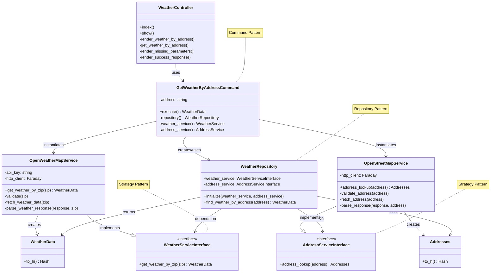

# Rails Weather App

rails application that retrieves weather information based on an address using SOLID principles and enterprise design patterns.

addresses/location are normalized using [OpenStreetMaps](https://nominatim.openstreetmap.org/ui/search.html?q=space+needle) and include a zip code.

weather information is retrieved from [OpenWeather API](https://www.weatherapi.com/api-explorer.aspx#forecast)

## Quickstart
```shell
# pre-requisites: ruby 3.4.5
bundle install
OPEN_WEATHER_API_KEY= ./bin/rails server
# http://127.0.0.1:3000/

# alternatively
docker build -t rails-weather-app .
docker run -e OPEN_WEATHER_API_KEY= -e RAILS_MASTER_KEY=$(cat config/master.key) -p 3000:3000 rails-weather-app
# http://127.0.0.1:3000/
```

## Architecture

weather data is cached for 30 minutes by zipcode

### [SOLID Principles](https://en.wikipedia.org/wiki/SOLID)

* single responsibility principle: each class a single responsibility
  * `WeatherService` - weather API
  * `GeocodingService` - address normalization
  * `WeatherRepository` - coordinates data retrieval
  * `WeatherController` - handles HTTP requests

* open/closed principle: open for extension, closed for modification
  * open for extension by implementing interfaces, private methods to prevent modifications
    * `WeatherServiceInterface` and `GeocodingServiceInterface` define interfaces
  * interface design allows for easy service swapping

* liskov substitution principle: implementations are substitutable by their interfaces
  * weather and address services can be substituted in `WeatherRepository`
  * any weather/address service implementing `WeatherServiceInterface` or `GeocodingServiceInterface` can be used

* interface segregation principle: focused, specific interfaces
  * separate interfaces for weather/address services
  * no dependencies on unused methods

* dependency inversion principle: high level modules don't depend on low level modules
  * repository class `WeatherRepository` abstracts data access
  * services are injected as dependencies


### [Design Patterns](https://en.wikipedia.org/wiki/Design_Patterns)
* repository pattern
  * `WeatherRepository` isolates data access and separate concerns by keeping application logic separate
* command pattern
  * `GetWeatherByAddressCommand` decouples sender of request from receiver providing more flexibility
* strategy pattern
  * `WeatherRepository` separate concerns as services and make them interchangeable allowing flexibility
* factory pattern
  * `GetWeatherByAddressCommand` client doesn't create objects directly


### UML Diagram

